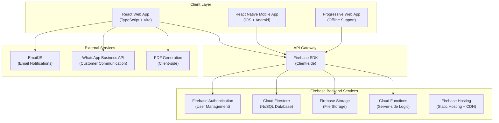
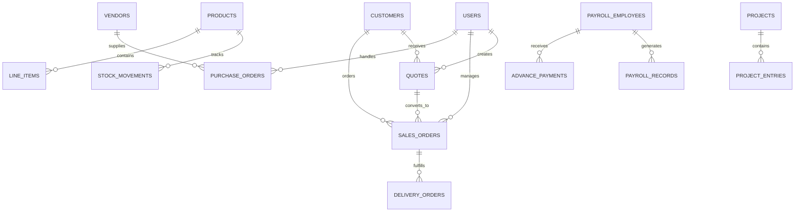
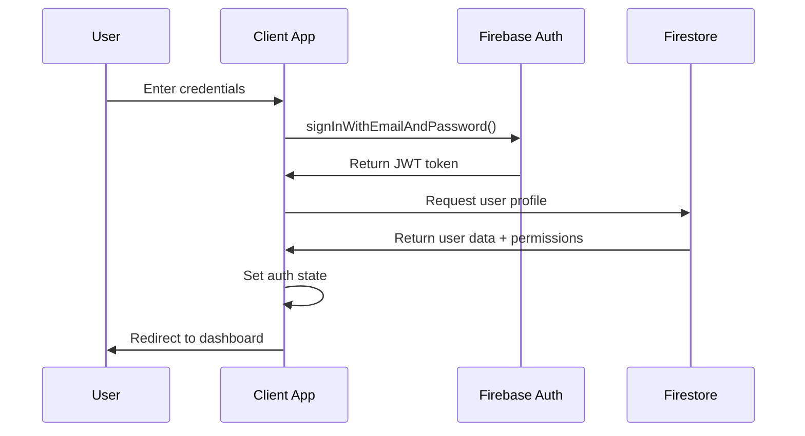
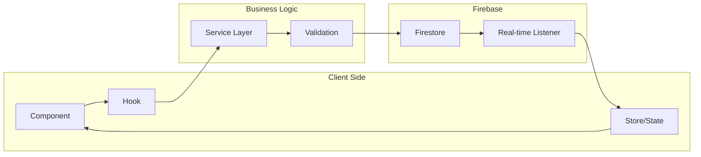
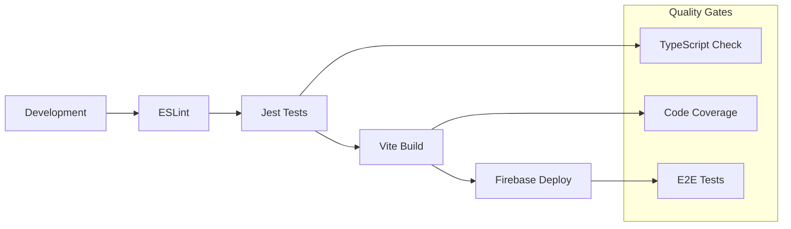

# Technical Architecture Documentation

## 🏗️ System Architecture Overview

ABS OMS with Payroll follows a modern, cloud-native architecture built on Firebase services with a React frontend. The system is designed for scalability, real-time collaboration, and offline functionality.

## 📊 High-Level Architecture Diagram



## 🎯 Design Principles

### 1. **Offline-First Architecture**
- **Local Storage**: IndexedDB persistence via Firestore
- **Sync Strategy**: Optimistic updates with conflict resolution
- **Data Consistency**: Event sourcing for critical operations
- **Network Resilience**: Graceful degradation when offline

### 2. **Real-time Collaboration**
- **Live Updates**: Firestore real-time listeners
- **Concurrent Editing**: Operational transforms for documents
- **Conflict Resolution**: Last-writer-wins with timestamps
- **Presence Indicators**: Real-time user status

### 3. **Security-First Design**
- **Zero-Trust Architecture**: All requests authenticated
- **Fine-grained Permissions**: Role-based access control (RBAC)
- **Data Validation**: Client and server-side validation
- **Audit Trail**: Comprehensive logging for compliance

### 4. **Performance Optimization**
- **Code Splitting**: Route-based and component-based chunking
- **Lazy Loading**: Dynamic imports for non-critical components
- **Caching Strategy**: Multi-layered caching (browser, CDN, database)
- **Bundle Optimization**: Tree-shaking and dead code elimination

## 🗄️ Database Architecture

### Firestore Data Model



### Collection Structure

#### Core Business Collections
```typescript
// Collection: users
interface User {
  id: string;
  email: string;
  name: string;
  role: 'admin' | 'maker' | 'approver' | 'viewer' | 'payroll_admin' | 'projects_admin';
  permissions: string[];
  createdAt: Timestamp;
  lastActive: Timestamp;
  profilePicture?: string;
}

// Collection: customers
interface Customer {
  id: string;
  name: string;
  email: string;
  phone: string;
  gstin?: string;
  addresses: Address[];
  contacts: Contact[];
  creditLimit?: number;
  paymentTerms?: string;
  createdAt: Timestamp;
  updatedAt: Timestamp;
}

// Collection: products
interface Product {
  id: string;
  name: string;
  description: string;
  unit: string;
  rate: number;
  hsnCode: string;
  category?: string;
  tags: string[];
  isActive: boolean;
  createdAt: Timestamp;
  updatedAt: Timestamp;
}

// Collection: quotes
interface Quote {
  id: string;
  quoteNumber: string;
  customerId: string;
  customerName: string;
  pointOfContactId?: string;
  lineItems: LineItem[];
  subtotal: number;
  tax: number;
  total: number;
  status: DocumentStatus;
  issueDate: string;
  validUntil: string;
  terms: string;
  notes?: string;
  revisionNumber?: number;
  parentQuoteId?: string;
  createdBy: string;
  createdAt: Timestamp;
  updatedAt: Timestamp;
}

// Collection: stock_movements
interface StockMovement {
  id: string;
  productId: string;
  productName: string;
  type: 'in' | 'out' | 'adjustment';
  quantity: number;
  unit: string;
  reason: string;
  referenceDocument?: string;
  referenceId?: string;
  previousStock: number;
  newStock: number;
  createdBy: string;
  createdAt: Timestamp;
}
```

#### Payroll Collections
```typescript
// Collection: payroll_employees
interface PayrollEmployee {
  id: string;
  employeeId: string;
  name: string;
  email: string;
  phone: string;
  department: string;
  designation: string;
  dateOfJoining: string;
  salary: {
    basic: number;
    hra: number;
    allowances: number;
    total: number;
  };
  bankDetails: {
    accountNumber: string;
    ifscCode: string;
    bankName: string;
  };
  panNumber: string;
  aadharNumber: string;
  pfNumber?: string;
  esiNumber?: string;
  isActive: boolean;
  createdAt: Timestamp;
  updatedAt: Timestamp;
}

// Collection: payroll_records
interface PayrollRecord {
  id: string;
  employeeId: string;
  month: number;
  year: number;
  earnings: {
    basic: number;
    hra: number;
    allowances: number;
    overtime: number;
    bonus: number;
  };
  deductions: {
    pf: number;
    esi: number;
    tds: number;
    advance: number;
    other: number;
  };
  netPay: number;
  workingDays: number;
  actualDays: number;
  leaveDays: number;
  status: 'draft' | 'approved' | 'paid';
  processedAt: Timestamp;
  processedBy: string;
}
```

### Indexing Strategy

```javascript
// Composite Indexes for Performance
const indexes = [
  // Quotes by customer and status
  { collection: 'quotes', fields: ['customerId', 'status', 'issueDate'] },
  
  // Sales orders by status and date
  { collection: 'sales_orders', fields: ['status', 'orderDate'] },
  
  // Stock movements by product and date
  { collection: 'stock_movements', fields: ['productId', 'createdAt'] },
  
  // Payroll records by employee and period
  { collection: 'payroll_records', fields: ['employeeId', 'year', 'month'] },
  
  // Chat messages by room and timestamp
  { collection: 'chat_messages', fields: ['roomId', 'timestamp'] },
  
  // Search indexes for text fields
  { collection: 'customers', fields: ['name', 'email', 'phone'] },
  { collection: 'products', fields: ['name', 'description', 'hsnCode'] }
];
```

## 🔧 Frontend Architecture

### Component Hierarchy

```
App
├── AuthProvider (Context)
├── ThemeProvider (Context)
├── Router
│   ├── PublicRoutes
│   │   └── LoginPage
│   └── ProtectedRoutes
│       ├── Layout
│       │   ├── Header
│       │   ├── Sidebar
│       │   └── MainContent
│       ├── Dashboard
│       ├── Sales Module
│       │   ├── QuoteList
│       │   ├── QuoteForm
│       │   ├── SalesOrderList
│       │   ├── DeliveryOrderList
│       │   └── PendingItems
│       ├── Purchase Module
│       ├── Inventory Module
│       ├── Payroll Module
│       └── Settings Module
```

### State Management Architecture

```typescript
// Global State (React Context)
interface AppState {
  user: User | null;
  theme: 'light' | 'dark';
  company: CompanySettings;
  permissions: Permission[];
}

// Local State (Zustand Stores)
interface SalesStore {
  quotes: Quote[];
  salesOrders: SalesOrder[];
  deliveryOrders: DeliveryOrder[];
  loading: boolean;
  error: string | null;
  
  // Actions
  fetchQuotes: () => Promise<void>;
  createQuote: (quote: Partial<Quote>) => Promise<Quote>;
  updateQuote: (id: string, updates: Partial<Quote>) => Promise<void>;
  deleteQuote: (id: string) => Promise<void>;
}

// Component State (useState/useReducer)
interface FormState {
  values: Record<string, any>;
  errors: Record<string, string>;
  touched: Record<string, boolean>;
  isSubmitting: boolean;
}
```

### Custom Hooks Architecture

```typescript
// Data Fetching Hooks
const useQuotes = (filters?: QuoteFilters) => {
  const [quotes, setQuotes] = useState<Quote[]>([]);
  const [loading, setLoading] = useState(true);
  const [error, setError] = useState<string | null>(null);
  
  // Real-time subscription logic
  useEffect(() => {
    const unsubscribe = subscribeToQuotes(filters, {
      onData: setQuotes,
      onError: setError,
      onLoading: setLoading
    });
    
    return unsubscribe;
  }, [filters]);
  
  return { quotes, loading, error, refetch };
};

// Business Logic Hooks
const useDocumentNumbering = (type: DocumentType) => {
  return useMemo(() => {
    const settings = getDocumentNumberingSettings();
    return generateNextNumber(type, settings);
  }, [type]);
};

// UI Interaction Hooks
const useKeyboardShortcuts = (shortcuts: ShortcutMap) => {
  useEffect(() => {
    const handleKeyDown = (event: KeyboardEvent) => {
      // Handle keyboard shortcuts
    };
    
    document.addEventListener('keydown', handleKeyDown);
    return () => document.removeEventListener('keydown', handleKeyDown);
  }, [shortcuts]);
};
```

## 🔐 Security Architecture

### Authentication Flow



### Authorization System

```typescript
// Permission-based access control
interface Permission {
  module: string;
  action: 'create' | 'read' | 'update' | 'delete';
  resource?: string;
  condition?: string;
}

// Role definitions
const ROLES = {
  admin: {
    permissions: ['*'], // All permissions
    modules: ['*'] // All modules
  },
  maker: {
    permissions: ['create', 'read', 'update'],
    modules: ['sales', 'purchase', 'inventory', 'customers', 'vendors', 'products']
  },
  approver: {
    permissions: ['read', 'approve'],
    modules: ['sales', 'purchase', 'reports']
  },
  viewer: {
    permissions: ['read'],
    modules: ['sales', 'purchase', 'inventory', 'customers', 'vendors', 'products']
  },
  payroll_admin: {
    permissions: ['*'],
    modules: ['payroll']
  }
};

// Permission checking utility
const canPerformAction = (user: User, action: string, resource?: string) => {
  if (user.role === 'admin') return true;
  
  const rolePermissions = ROLES[user.role];
  if (!rolePermissions) return false;
  
  return rolePermissions.permissions.includes(action) || 
         rolePermissions.permissions.includes('*');
};
```

### Firestore Security Rules

```javascript
rules_version = '2';
service cloud.firestore {
  match /databases/{database}/documents {
    // Users can only access their own profile
    match /users/{userId} {
      allow read, write: if request.auth != null && request.auth.uid == userId;
      allow read: if request.auth != null && 
                     resource.data.role == 'admin';
    }
    
    // Business documents require authentication
    match /quotes/{quoteId} {
      allow read: if request.auth != null;
      allow create, update: if request.auth != null && 
                              hasPermission(request.auth.uid, 'create', 'quotes');
      allow delete: if request.auth != null && 
                      hasPermission(request.auth.uid, 'delete', 'quotes');
    }
    
    // Payroll data requires special permission
    match /payroll_employees/{empId} {
      allow read, write: if request.auth != null && 
                           (hasRole(request.auth.uid, 'admin') ||
                            hasRole(request.auth.uid, 'payroll_admin'));
    }
    
    // Helper functions
    function hasPermission(uid, action, resource) {
      let userDoc = get(/databases/$(database)/documents/users/$(uid));
      return userDoc.data.role == 'admin' || 
             (userDoc.data.permissions != null &&
              action in userDoc.data.permissions[resource]);
    }
    
    function hasRole(uid, role) {
      let userDoc = get(/databases/$(database)/documents/users/$(uid));
      return userDoc.data.role == role;
    }
  }
}
```

## 📱 Mobile Architecture

### React Native Structure

```
ABSOMSMobile/
├── src/
│   ├── components/
│   │   ├── common/          # Shared UI components
│   │   ├── forms/           # Form components
│   │   └── lists/           # List components
│   ├── screens/             # Screen components
│   │   ├── auth/           # Authentication screens
│   │   ├── dashboard/      # Dashboard screens
│   │   ├── sales/          # Sales module screens
│   │   ├── inventory/      # Inventory screens
│   │   └── settings/       # Settings screens
│   ├── navigation/         # Navigation configuration
│   ├── services/           # API services
│   ├── contexts/           # React contexts
│   ├── database/          # Local database (SQLite)
│   └── utils/             # Utility functions
├── android/               # Android-specific code
├── ios/                   # iOS-specific code
└── package.json
```

### Offline Synchronization

```typescript
interface SyncManager {
  // Queue operations when offline
  queueOperation: (operation: Operation) => void;
  
  // Sync with server when online
  syncWithServer: () => Promise<void>;
  
  // Handle conflicts
  resolveConflict: (local: Document, remote: Document) => Document;
  
  // Monitor connection status
  onConnectionChange: (callback: (online: boolean) => void) => void;
}

// Offline queue implementation
class OfflineQueue {
  private queue: Operation[] = [];
  
  add(operation: Operation) {
    this.queue.push({
      ...operation,
      timestamp: Date.now(),
      id: generateId()
    });
    this.saveToStorage();
  }
  
  async processQueue() {
    while (this.queue.length > 0) {
      const operation = this.queue.shift();
      try {
        await this.executeOperation(operation);
      } catch (error) {
        // Handle sync errors
        this.handleSyncError(operation, error);
      }
    }
  }
}
```

## 🔄 Data Flow Architecture

### Real-time Data Flow



### Form Data Processing

```typescript
// Form submission pipeline
interface FormPipeline {
  // 1. Validation
  validate: (data: any) => ValidationResult;
  
  // 2. Transformation
  transform: (data: any) => TransformedData;
  
  // 3. Business rules
  applyBusinessRules: (data: TransformedData) => ProcessedData;
  
  // 4. Persistence
  persist: (data: ProcessedData) => Promise<SavedData>;
  
  // 5. Side effects
  applySideEffects: (data: SavedData) => Promise<void>;
}

// Example: Quote creation pipeline
const createQuotePipeline: FormPipeline = {
  validate: (data) => validateQuoteData(data),
  transform: (data) => ({
    ...data,
    quoteNumber: generateQuoteNumber(),
    issueDate: new Date().toISOString(),
    status: DocumentStatus.Draft
  }),
  applyBusinessRules: (data) => calculateTotals(data),
  persist: async (data) => await saveQuote(data),
  applySideEffects: async (quote) => {
    await updateCustomerLastActivity(quote.customerId);
    await logActivity('quote_created', quote.id);
    await sendNotification(quote.assignedTo, 'New quote created');
  }
};
```

## ⚡ Performance Architecture

### Optimization Strategies

#### 1. **Component Optimization**
```typescript
// Memoization for expensive components
const ExpensiveComponent = React.memo(({ data, filters }) => {
  const processedData = useMemo(() => 
    processLargeDataset(data, filters), 
    [data, filters]
  );
  
  const handleAction = useCallback((id) => {
    // Handle action
  }, []);
  
  return <div>{/* Render component */}</div>;
});

// Virtual scrolling for large lists
const VirtualizedList = ({ items }) => {
  return (
    <FixedSizeList
      height={600}
      itemCount={items.length}
      itemSize={50}
      itemData={items}
    >
      {Row}
    </FixedSizeList>
  );
};
```

#### 2. **Data Loading Optimization**
```typescript
// Pagination with cursor-based loading
const usePaginatedData = (collection: string, pageSize: number = 20) => {
  const [data, setData] = useState([]);
  const [lastDoc, setLastDoc] = useState(null);
  const [hasMore, setHasMore] = useState(true);
  
  const loadMore = useCallback(async () => {
    const query = collection(db, collection)
      .orderBy('createdAt', 'desc')
      .limit(pageSize);
    
    if (lastDoc) {
      query.startAfter(lastDoc);
    }
    
    const snapshot = await getDocs(query);
    const newData = snapshot.docs.map(doc => ({ id: doc.id, ...doc.data() }));
    
    setData(prev => [...prev, ...newData]);
    setLastDoc(snapshot.docs[snapshot.docs.length - 1]);
    setHasMore(snapshot.docs.length === pageSize);
  }, [lastDoc, pageSize]);
  
  return { data, loadMore, hasMore };
};

// Optimistic updates
const useOptimisticUpdate = () => {
  return useCallback(async (optimisticUpdate, serverUpdate) => {
    // Apply optimistic update immediately
    optimisticUpdate();
    
    try {
      // Perform server update
      await serverUpdate();
    } catch (error) {
      // Revert optimistic update on error
      optimisticUpdate.revert();
      throw error;
    }
  }, []);
};
```

#### 3. **Bundle Optimization**
```typescript
// Route-based code splitting
const Dashboard = lazy(() => import('./components/Dashboard'));
const SalesModule = lazy(() => import('./components/sales/SalesModule'));
const PayrollModule = lazy(() => import('./components/payroll/PayrollModule'));

// Component-based code splitting
const HeavyChart = lazy(() => import('./components/HeavyChart'));

// Dynamic imports for utilities
const loadPDFGenerator = () => import('./utils/pdfGenerator');
const loadExcelExporter = () => import('./utils/excelExporter');
```

### Monitoring and Analytics

```typescript
// Performance monitoring
interface PerformanceMetrics {
  componentRenderTime: number;
  dataFetchTime: number;
  bundleSize: number;
  memoryUsage: number;
  errorRate: number;
}

// Custom performance hook
const usePerformanceMonitoring = (componentName: string) => {
  useEffect(() => {
    const startTime = performance.now();
    
    return () => {
      const endTime = performance.now();
      const renderTime = endTime - startTime;
      
      // Log performance metrics
      analytics.track('component_render', {
        component: componentName,
        renderTime,
        timestamp: Date.now()
      });
    };
  }, [componentName]);
};
```

## 🔧 Development Tools & Workflow

### Build Pipeline



### Development Environment

```json
{
  "scripts": {
    "dev": "vite --host",
    "build": "tsc && vite build",
    "preview": "vite preview",
    "test": "jest",
    "test:watch": "jest --watch",
    "test:coverage": "jest --coverage",
    "lint": "eslint . --ext ts,tsx",
    "lint:fix": "eslint . --ext ts,tsx --fix",
    "type-check": "tsc --noEmit",
    "deploy": "npm run build && firebase deploy"
  }
}
```

### Code Quality Tools

```typescript
// ESLint configuration
module.exports = {
  extends: [
    '@typescript-eslint/recommended',
    'plugin:react/recommended',
    'plugin:react-hooks/recommended'
  ],
  rules: {
    '@typescript-eslint/no-unused-vars': 'error',
    'react/prop-types': 'off',
    'react-hooks/exhaustive-deps': 'warn'
  }
};

// Prettier configuration
module.exports = {
  semi: true,
  trailingComma: 'es5',
  singleQuote: true,
  printWidth: 100,
  tabWidth: 2
};
```

This architecture provides a solid foundation for a scalable, maintainable, and performant ERP system that can grow with business needs while maintaining security and user experience standards.